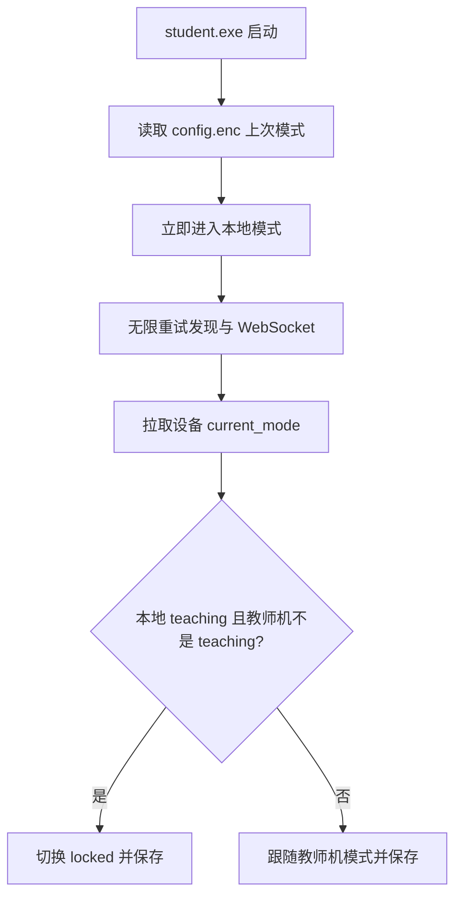

# 学生机重连、签到输入与管理入口调整

Feature Name: agent-reconnect-checkin-ux
Updated: 2026-09-19

## Description

学生机连接教师机失败后保持运行并无限重试；启动时先恢复本地上次模式，连上后按「授课已结束则锁定、否则跟随教师机」同步。开放模式签到放开 IME 与单独 Shift，保留系统快捷键屏蔽。授课模式签到只接受学号+密码。批量重置密码移到学生管理（用当前班级筛选）；班级管理去掉模式切换分区。

## Architecture

启动后本地模式立刻生效（开放则拉起 `campus-checkin`，锁定则拉起 `campus-lock`）。教师机不可达时进程不退出。连上后用教师机 `student_devices.current_mode` 判定课程是否结束。

## Components and Interfaces

### agent-core 连接循环

- `WebSocketClient.max_reconnect_attempts` 改为无上限；`should_reconnect()` 只判断连接是否断开。
- `HeartbeatLoop::run` 在首次 `connect()` 失败时进入同一套退避重试，不再 `return Err`。
- `main` 在注册、硬件快照失败时记录日志并继续进入心跳循环。
- 退避保持指数增长并设上限（建议 30 秒），避免空转打满 CPU。
- `campus-guard` 的 `MAX_EXIT_COUNT` 取消或改为持续拉起，避免学生主进程退出后守护也停。

### 启动模式恢复

- 配置加载后、连接成功前调用现有 `handle_mode_switch`（或等价入口）应用 `config.current_mode`；空值或非法值按 `open`。
- 连接成功后增加一次设备状态同步（复用注册响应的 `initial_mode`，或新增/使用已有设备查询）。若本地为 `teaching` 且教师机该设备 `current_mode != teaching`，则切到 `locked`；其余情况跟随教师机模式。
- 模式变更后 `config.save()`，保证下次开机仍能恢复。

### campus-checkin / campus-lock 输入

- 删除 `campus-checkin` 启动时的 `ImmDisableIME`。
- `keyhook.rs` 的 `should_block` 继续拦截 Win / Alt+Tab / Alt+Esc / Alt+F4 / Ctrl+Esc / Ctrl+Alt+Delete；单独 `VK_SHIFT` 放行。
- 姓名输入框获得焦点时调用 Windows IME API 开启中文输入法（如 `ImmAssociateContext` / 切换到中文键盘布局）。锁屏界面仍禁用 IME（密码为 ASCII）。

### 授课签到身份

- `campus-checkin` 授课界面文案改为「学号」，hint 不再写「学号或姓名」。
- `teacher-server` `student_login` 改为 `WHERE student_no = ?` 精确匹配，去掉 `OR name = ?`。
- `check_in` 在 `teaching` 下继续要求已登录的 `student_id`；无该标识则拒绝。

### 教师端入口

- `Classes.vue`：删除「批量重置密码」按钮、`resetPasswords`、模式切换分区与 `changeMode`。
- `Students.vue`：工具栏增加「批量重置密码」。`selectedClassId` 有值则重置该班；为空则提示先筛选班级。调用现有 `POST /api/classes/:id/passwords/reset`。

## Data Models

不新增表。沿用：

- 学生机 `Config.current_mode`（`config.enc`）
- `student_devices.current_mode`
- `students.student_no` / `password_hash` / `password_set`

「课程已结束」为运行时判定：本地 `teaching` 且教师机该设备 `current_mode != "teaching"`。

## Correctness Properties

- 学生主进程在教师机不可达时保持存活。
- 启动后、连上教师机前，本地模式已作用于锁屏/签到子进程。
- 授课已结束的启动路径最终模式为 `locked`。
- 授课签到不能仅凭姓名通过身份校验。
- 开放模式姓名框可提交 IME 汉字，同时系统快捷键仍被拦截。
- 班级管理页不再发起模式切换或批量重置密码。

## Error Handling

- 发现/连接失败：打日志，按退避继续，界面保持本地模式。
- 同步教师机模式失败：保持本地模式并继续重试。
- 授课签到学号不存在或密码错误：返回「学号或密码错误」，签到窗不关闭。
- 学生管理未选班级就点批量重置：前端提示，不发请求。

## Test Strategy

- agent-core：连接失败不退出；重连计数超过原 5 次上限仍继续；本地 teaching + 教师机 open 启动后变为 locked。
- auth：`student_login` 用姓名+正确密码失败，用学号+正确密码成功。
- attendance：teaching 且无 student_id 拒绝签到。
- 前端：Classes 无模式切换与批量重置；Students 在已选班级时可重置。

## References

[^1]: (Filename) - 当前工作区 `/.monkeycode/specs/agent-reconnect-checkin-ux/requirements.md`
[^2]: (Filename) - `CampusLink-NCMS/student-agent/agent-core/src/websocket.rs`
[^3]: (Filename) - `CampusLink-NCMS/student-agent/campus-checkin/src/keyhook.rs`
[^4]: (Filename) - `CampusLink-NCMS/teacher-server/src/domain/auth.rs`
