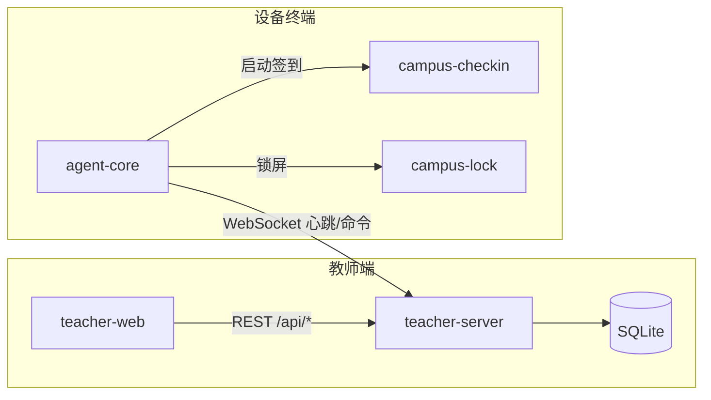
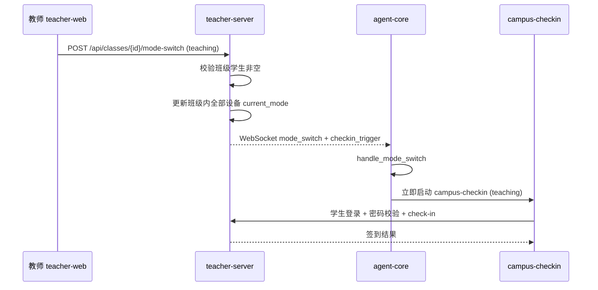

# 签到与模式切换增强

Feature Name: checkin-mode-enhancement
Updated: 2026-09-11

## Description

本设计覆盖 `requirements.md` 中 9 条需求，解决时间/状态显示、签到姓名展示、无需签到提示、模式切换触发签到、授课前置校验、班级管理、座位号绑定、签到密码设置与校验、教师端密码管理等问题。改动横跨三个工程：

- `teacher-server`：数据库迁移、领域模型、HTTP 接口、WebSocket 命令下发。
- `teacher-web`：监控时间显示、签到管理、班级与座位号管理、学生密码管理、模式切换交互。
- `student-agent`：模式切换触发签到、授课模式密码设置/校验流程。

核心设计决策：

1. 引入 `classes` 实体，学生与设备均可归属班级，一人至多一班。
2. 座位号是设备的固定物理属性（班级内唯一，按 IP 批量分配）；导入学生时为该学生指定座位号，签到仅在学生座位号与设备座位号一致时通过。
3. 教师导入学生时发放初始密码，以 `password_set` 标志区分「仍为初始密码」与「学生已自定义密码」；学生首次授课签到校验初始密码后强制设置新密码。
4. 时间统一以 UTC 存储、以 RFC3339 携带时区返回，前端统一本地化，修复状态恒为「延迟」。
5. 模式切换后向班级内全部设备下发签到触发；离线设备记录待触发，心跳恢复时补发。

## Architecture

模式切换命令链路：

## Components and Interfaces

### teacher-server

新增迁移：

- `0016_create_classes.sql`：`classes` 表。
- `0017_add_class_and_signin_fields.sql`：为 `students` 增加 `class_id`、`password_set`；为 `student_devices` 增加 `class_id`、`seat_no`；为 `attendance_records` 增加 `seat_no`。

新增/修改领域模块：

- `domain/class.rs`：班级 CRUD、学生归班、按班级查询设备、按班级批量切换模式。
- `domain/student.rs`：学号自动生成、密码状态、座位号校验、密码重置。
- `domain/attendance.rs`：签到返回姓名/学号/座位号；`CheckInRequest` 增加座位号快照。
- `domain/auth.rs`：`student_login` 在密码未设置时返回待设置状态；新增 `student_set_password`。

新增 HTTP 接口（JWT 保护）：

| 方法 | 路径 | 说明 |
|------|------|------|
| GET | `/api/classes` | 班级列表 |
| POST | `/api/classes` | 新建班级 |
| PUT | `/api/classes/{id}` | 重命名班级 |
| DELETE | `/api/classes/{id}` | 删除班级 |
| GET | `/api/classes/{id}/students` | 班级学生列表 |
| POST | `/api/classes/{id}/students/assign` | 批量把学生归入班级 |
| GET | `/api/classes/{id}/devices` | 班级设备列表 |
| POST | `/api/classes/{id}/mode-switch` | 按班级批量切换模式并触发签到 |
| POST | `/api/classes/{id}/seats/auto-by-ip` | 依据设备 IP 批量分配座位号 |
| POST | `/api/students/{id}/reset-signin-password` | 重置单个学生签到密码 |
| POST | `/api/students/batch-reset-signin-password` | 按班级批量重置 |

公开路由（设备侧，device_id 校验）：

| 方法 | 路径 | 说明 |
|------|------|------|
| POST | `/api/auth/student-login` | 已设置密码时校验；未设置时返回 `password_set=false` |
| POST | `/api/auth/student-set-password` | 首次签到设置密码 |
| POST | `/api/attendance/check-in` | 签到，携带座位号快照 |
| GET | `/api/attendance/context` | 返回指定班级/设备的当前模式，用于「无需签到」提示 |

WebSocket 命令扩展：

- `mode_switch`：保持现有字段，新增可选 `class_id`。
- `checkin_trigger`：`{ "type": "checkin_trigger", "device_id": "...", "mode": "open|teaching" }`。

离线补触发：为 `student_devices` 增加 `pending_checkin` 标志。班级切换至需要签到的模式时，服务端对班级内每台设备写入 `pending_checkin=1`；在线设备立即广播 `checkin_trigger` 并清除标志，离线设备在下次心跳到达时由服务端随心跳响应下发 `checkin_trigger` 并清除标志。

### teacher-web

- `src/utils/time.ts`：新增 `parseServerTime(value)`（无时区时补 `Z`）与 `formatLocalTime`，替换 `Monitor.vue:93`、`Monitor.vue:100`、`Devices.vue:36` 的裸 `new Date`。
- `src/views/Attendance.vue`：新增「姓名」「学号」「座位号」列；顶部根据 `/api/attendance/context` 显示「当前模式不需要签到」提示或签到入口。
- `src/views/Devices.vue`：授课模式切换弹窗增加班级选择，提交 `/api/classes/{id}/mode-switch`。
- `src/views/Classes.vue`：新增班级管理页，含学生归班、设备列表、按 IP 分配座位号、批量重置密码。
- `src/views/Students.vue`：新增所属班级、签到密码状态、重置密码按钮。
- `src/api/classes.ts`：新增班级相关接口封装。

### student-agent

- `agent-core/src/command_handler.rs`：处理 `mode_switch` 后，若目标模式需要签到，调用 `attendance::check_in_interactive`；处理 `checkin_trigger` 同样触发。
- `agent-core/src/attendance.rs`：`check_in_interactive` 不再仅限启动调用，可被命令再次触发；授课模式签到成功后绑定设备与学生并带上设备座位号。
- `campus-checkin/src/main.rs`：授课模式流程改为「输入学号或姓名 + 密码 → 校验初始密码 → 若未自定义则强制设置新密码 → 服务端校验学生座位号与设备座位号一致 → 签到」；开放模式保持仅输入姓名。

## Data Models

`classes`：

| 字段 | 类型 | 说明 |
|------|------|------|
| id | TEXT PK | UUID |
| name | TEXT UNIQUE NOT NULL | 班级名称 |
| created_at | TEXT | UTC |
| updated_at | TEXT | UTC |

`students` 增量：

| 字段 | 类型 | 说明 |
|------|------|------|
| class_id | TEXT NULL | 外键 -> classes(id) |
| password_set | INTEGER NOT NULL DEFAULT 0 | 0 仍为初始密码，1 学生已自定义 |
| password_hash | TEXT NULL | 初始密码或学生自定义密码的 bcrypt 哈希 |
| seat_no | TEXT NULL | 教师导入时指定的学生座位号 |

`student_devices` 增量：

| 字段 | 类型 | 说明 |
|------|------|------|
| class_id | TEXT NULL | 外键 -> classes(id) |
| seat_no | TEXT NULL | 固定物理座位号，班级内唯一 |
| pending_checkin | INTEGER NOT NULL DEFAULT 0 | 1 表示有待补发的签到触发 |

`attendance_records` 增量：

| 字段 | 类型 | 说明 |
|------|------|------|
| seat_no | TEXT NULL | 签到时的座位号快照 |

座位号分配规则（`auto-by-ip`）：为班级内每台设备按 IPv4 末段（或提供的 IP→座位号映射表）分配座位号，若与同班已有座位号冲突则顺延并记录冲突清单；教师可随后手工调整。导入学生时必须在导入模板中提供与学生机器一致的座位号。

## Correctness Properties

1. 对任一以 UTC 存储的心跳时间 `T`，教师端展示值满足 `display = T + local_offset`；在线判定满足 `now_utc - T <= 30s`。
2. 每名学生的 `class_id` 至多指向一个班级；同一班级内设备 `seat_no` 不重复。
3. 仅当所选班级存在至少一名学生时，才允许切换到 `teaching`。
4. `password_set = 0` 表示 `password_hash` 为教师发放的初始密码；学生首次授课签到成功后 `password_set` 置为 1 且 `password_hash` 更新为学生自定义密码。
5. 授课模式签到通过当且仅当学生 `seat_no` 与签到设备 `seat_no` 相等且密码校验通过。
6. 按班级切换模式仅更新该班关联设备的 `current_mode`，其他班级设备不受影响。
7. `pending_checkin = 1` 的设备在恢复在线并完成一次心跳后，必然收到一次 `checkin_trigger` 且标志清零。
8. 签到记录一旦写入，其 `seat_no` 快照不随后续座位调整而变化。

## Error Handling

| 场景 | 行为 |
|------|------|
| 授课切换未选择班级 | 返回 400「请选择班级」 |
| 授课切换所选班级无学生 | 返回 400「请先补充学生信息」 |
| 学生用姓名登录且重名 | 返回 409「姓名重复，请使用学号」 |
| 初始密码或自定义密码错误 | 返回 401「密码错误」 |
| 学生座位号与签到设备座位号不一致 | 返回 403「座位不匹配，请在指定机器的座位签到」 |
| 设备 `pending_checkin=1` 但心跳尚未到达 | 保留标志，下次心跳补发 |
| 按 IP 分配座位号冲突 | 顺延分配并在响应中返回冲突列表 |
| IP 无法匹配设备 | 跳过该 IP 并在响应中返回未匹配列表 |
| 时间字段缺失时区 | 前端按 UTC 解析并本地化 |

## Test Strategy

- Rust 单元测试（`domain/test_support.rs` 内存库）：
  - 班级 CRUD 与一人一班约束。
  - 设备座位号班级内唯一与按 IP 分配。
  - 授课模式切换前置校验（有/无学生）。
  - 初始密码校验、首次签到修改密码、自定义密码再次校验、教师重置。
  - 座位号不匹配时拒绝签到。
  - 签到返回姓名/学号/座位号。
  - 离线设备 `pending_checkin` 在心跳后补发且清零。
- 前端单元测试：`parseServerTime` 对不同时区串的解析；`Attendance.vue` 在 `exam/locked` 下显示提示。
- 集成测试：模拟 `mode_switch` 到 `teaching` 后，验证下发 `checkin_trigger` 与离线补发。

## References

[^1]: `teacher-server/src/domain/student.rs:81` - 学生创建与学号处理
[^2]: `teacher-server/src/domain/attendance.rs:74` - 签到写入
[^3]: `teacher-server/src/domain/auth.rs:139` - 学生登录校验
[^4]: `teacher-server/src/api/handlers.rs:152` - 模式切换与 WebSocket 下发
[^5]: `student-agent/agent-core/src/command_handler.rs:79` - 设备端模式切换处理
[^6]: `student-agent/agent-core/src/attendance.rs:80` - 启动签到与模式规则
[^7]: `teacher-web/src/views/Monitor.vue:93` - 在线状态判定
[^8]: `teacher-web/src/views/Attendance.vue:11` - 签到记录表格
