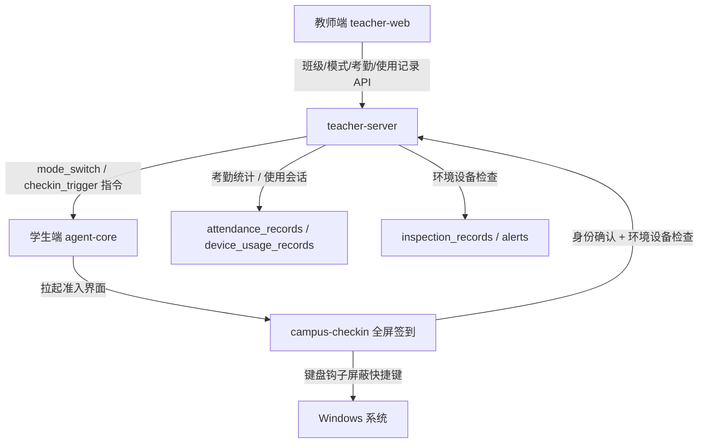
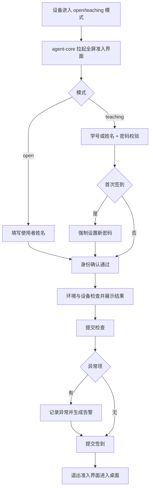
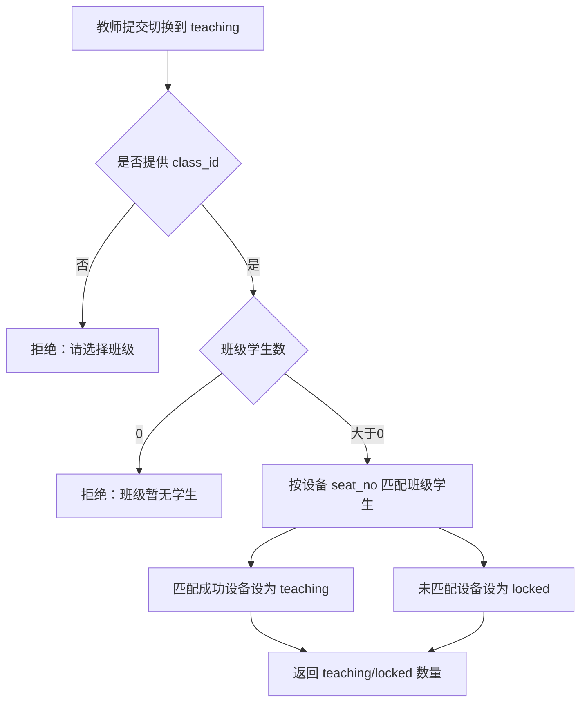
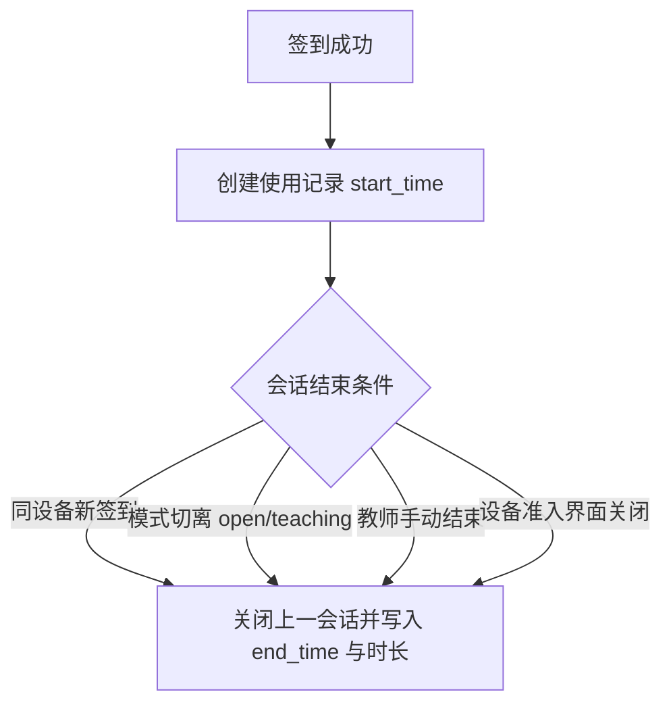

# 签到准入、考勤与设备使用记录增强

Feature Name: checkin-usage-inspection
Updated: 2026-09-16

## 描述

本设计在既有「班级 / 座位 / 签到密码 / 模式切换触发」能力上，补齐四项能力：

1. 授课模式准入：切换授课模式必须选择班级，班级无学生则拒绝；班级内未分配学生的设备进入锁定模式。
2. 考勤化签到：签到管理只统计授课模式签到，支持筛选、导出与出勤/缺勤看板；开放模式签到转为使用记录。
3. 强制签到准入：签到界面按锁屏规格实现（全屏、置顶、屏蔽系统快捷键），未完成身份确认与环境设备检查不得进入桌面。
4. 设备使用记录：记录学生机从签到开始的会话、使用人、时长与环境设备检查结果，支持查询、筛选与导出。
5. 锁屏界面中文化与布局美化。

## 架构



准入流程（设备侧）：



## 组件与接口

### 服务端（teacher-server）

| 方法 | 路径 | 说明 |
| --- | --- | --- |
| POST | `/api/devices/:id/mode` | 切换单设备模式，请求体新增可选 `class_id`；授课模式按班级学生人数与座位匹配校验 |
| POST | `/api/classes/:id/mode` | 按班级批量切换，返回 `teaching_device_ids` 与 `locked_device_ids` |
| GET | `/api/attendance` | 仅返回授课模式签到，支持 `class_id`、`start_date`、`end_date`、`student_keyword`、`status` 过滤 |
| GET | `/api/attendance/board` | 考勤看板：按班级与日期返回应出勤人数、已签到、缺勤、出勤率与缺勤名单 |
| GET | `/api/attendance/export` | 按当前过滤条件导出考勤 CSV |
| POST | `/api/attendance/check-in` | 请求体新增可选 `inspection_items`、`is_abnormal`；授课模式写入考勤，开放模式写入使用记录 |
| GET | `/api/usage` | 设备使用记录查询，支持 `device_id`、`class_id`、`student_keyword`、`start_date`、`end_date` 过滤 |
| GET | `/api/usage/export` | 按当前过滤条件导出使用记录 CSV |
| POST | `/api/usage/:id/end` | 教师手动结束某条使用会话 |
| GET | `/api/attendance/context` | 保持返回 `mode`、`requiresCheckin`、`classId` |

考勤看板响应结构：

```json
{
  "classId": "c1",
  "className": "计算机1班",
  "date": "2026-09-16",
  "totalStudents": 40,
  "presentCount": 36,
  "absentCount": 4,
  "attendanceRate": 0.9,
  "present": [],
  "absent": []
}
```

使用记录响应结构：

```json
{
  "id": "u1",
  "deviceId": "d1",
  "deviceName": "PC-01",
  "classId": "c1",
  "className": "计算机1班",
  "seatNo": "01",
  "studentId": "s1",
  "studentNo": "S12345678",
  "studentName": "张三",
  "mode": "open",
  "startTime": "2026-09-16T01:00:00Z",
  "endTime": "2026-09-16T02:10:00Z",
  "durationSeconds": 4200,
  "inspectionOk": false,
  "inspectionSummary": "键盘接口异常"
}
```

### 设备端（student-agent）

- `agent-core/src/mode.rs`：`open` 与 `teaching` 模式进入准入状态，调用准入界面替代当前无操作实现；准入界面异常退出时按监控逻辑重新拉起。
- `agent-core/src/attendance.rs`：`check_in_interactive` 改为启动全屏准入界面并在退出码为完成后才视为签到完成；未完成时保持准入。
- `campus-checkin/src/main.rs`：窗口改为全屏、无边框、置顶；新增环境与设备检查阶段（身份 → 检查 → 提交）；复用 `hardware.rs` 与 `inspection.rs` 采集项；请求体携带 `inspection_items` 与 `is_abnormal`。
- `campus-checkin/src/keyhook.rs`：从 `campus-lock` 迁移键盘钩子实现，屏蔽 Windows 键、Alt+Tab、Alt+F4、Ctrl+Esc、任务管理器与全屏切换快捷键。
- `campus-lock/src/main.rs`：文案改为简体中文并调整布局分区。

### 教师端（teacher-web）

- `views/Attendance.vue`：新增班级、日期范围、学生关键字、状态筛选；新增考勤看板（应出勤/已签到/缺勤/出勤率）与缺勤名单；新增导出按钮；不再展示开放模式签到。
- `views/Usage.vue`：新增设备使用查询模块，含筛选、列表、检查结果摘要、导出与手动结束会话。
- `views/Devices.vue`：授课模式切换弹窗要求选择班级，展示进入授课模式与进入锁定模式的设备数量。
- `api/attendance.ts`、`api/types.ts`：新增考勤看板、过滤参数与导出接口类型。
- `api/usage.ts`：新增使用记录查询与导出接口。
- `router/index.ts`、`components/Layout.vue`：注册「设备使用」菜单与路由。

## 数据模型

### 表 `device_usage_records`（新增）

| 字段 | 类型 | 说明 |
| --- | --- | --- |
| id | TEXT PK | 主键 |
| device_id | TEXT | 设备 |
| class_id | TEXT NULL | 班级快照 |
| seat_no | TEXT NULL | 座位号快照 |
| student_id | TEXT NULL | 学生主键，开放模式为 NULL |
| user_name | TEXT | 使用人姓名 |
| mode | TEXT | 会话开始时的模式 |
| start_time | TEXT | 开始时间（UTC） |
| end_time | TEXT NULL | 结束时间（UTC） |
| duration_seconds | INTEGER NULL | 使用时长 |
| inspection_ok | INTEGER | 环境设备检查是否全部正常 |
| inspection_summary | TEXT NULL | 异常项摘要 |
| created_at | TEXT | 创建时间 |

### 表 `attendance_records`（调整）

- 新逻辑仅写入授课模式签到；新增 `usage_record_id TEXT NULL` 关联使用会话。
- 既有开放模式历史记录保留，迁移时将其 `remarks` 前缀 `open-checkin:` 的数据标记为不计入考勤（查询层过滤）。

### 表 `students` / `student_devices`

- 复用现有 `class_id`、`seat_no`、`password_set`；准入校验依据设备 `seat_no` 与班级学生 `seat_no` 的匹配集合。

## 关键流程

模式切换准入（服务端）：



使用会话生命周期：



## 正确性属性

1. 授课模式签到记录数与考勤看板已签到人数一致。
2. 考勤看板满足 `应出勤人数 = 已签到人数 + 缺勤人数`，且 `缺勤名单` 与班级学生集合互补。
3. 任一设备在任一时刻至多存在一条 `end_time` 为空的使用记录。
4. 使用会话 `duration_seconds` 等于 `end_time` 与 `start_time` 之差且不小于 0。
5. 开放模式签到不改变考勤记录集合。
6. 需要签到的模式下，未完成准入流程的设备保持准入界面，不出现桌面可用窗口。
7. 班级学生数为 0 时，授课模式切换请求不改变任何设备模式。

## 错误处理

- 班级无学生：返回 `400` 与中文提示，教师端展示原因并保持原模式。
- 身份校验失败：准入界面保持在身份阶段并展示剩余尝试与原因。
- 环境设备检查采集失败：展示失败原因并提供「重新检查」；连续失败允许提交并标记检查异常。
- 签到网络失败：准入界面保持在检查阶段，提供重试。
- 使用记录重复关闭：第二次结束请求返回当前记录状态，不重复写入 `end_time`。
- 准入界面异常退出：`agent-core` 监控到非完成退出后重新拉起准入界面。

## 测试策略

- 服务端单元测试：模式切换准入（有/无学生、座位匹配与不匹配）、考勤过滤与看板计算、使用会话开启/关闭/时长、开放签到不写考勤、导出字段。
- 服务端接口冒烟：以临时 SQLite 库运行真实服务，串联班级、座位、签到、看板、使用记录与导出。
- 设备端单元测试：检查项采集与异常判定、准入退出码语义、键盘钩子按键拦截判定（纯函数化后的匹配逻辑）。
- 前端：以构建通过为基线，关键页面手动验证筛选、导出、看板与菜单。
- Windows 交叉编译与发布包重建作为最终验收。

## 已确认决策

1. 强制签到准入界面由 `campus-checkin` 实现：全屏、无边框、置顶并内置键盘钩子；`campus-lock` 保持纯锁屏职责。
2. 开放模式与授课模式均强制全屏准入，未提交使用者姓名与环境设备检查不得进入桌面。
3. 使用会话在以下任一条件下关闭：同设备新签到、模式切离 `open`/`teaching`、教师手动结束、准入界面关闭。

## 参考资料

- [^1]: (File) - `teacher-server/src/domain/attendance.rs`
- [^2]: (File) - `teacher-server/src/domain/class.rs`
- [^3]: (File) - `student-agent/campus-checkin/src/main.rs`
- [^4]: (File) - `student-agent/campus-lock/src/keyhook.rs`
- [^5]: (File) - `teacher-web/src/views/Attendance.vue`
- [^6]: (File) - `.monkeycode/specs/checkin-usage-inspection/requirements.md`
