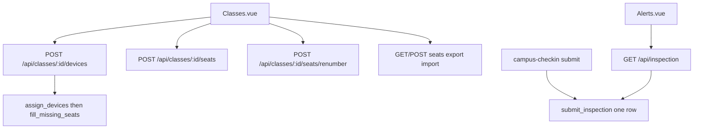

# 班级座位编号与检查记录汇总

Feature Name: class-seat-inspection
Updated: 2026-09-19

## Description

班级详情把学生机批量加入后自动分配 1、2、3… 座位号；支持顺序编号、保存、导出导入。检查提交合并为一条记录并带设备名称。

## Architecture

## Components and Interfaces

- `teacher-web/src/views/Classes.vue`：添加学生/添加学生机、勾选表格、保存/顺序编号/导出导入
- `teacher-server/src/domain/class.rs`：`fill_missing_seats`、`renumber_seats`、座位导入导出
- `teacher-server/src/domain/inspection.rs`：一次提交一条记录，列表带 `device_name`
- `teacher-web/src/views/Alerts.vue`：设备名称列

## Data Models

座位导入列：设备ID、设备名、IP、座位号。检查记录 `item_name` 为检查类型摘要，`description` 为各项 `名称:状态` 拼接。

## Correctness Properties

1. 同一班级内已分配座位号互不重复
2. 一次检查提交对应一条 `inspection_records`
3. 导入失败时该班座位号保持原值

## Error Handling

唯一约束与导入错误返回 `code=400` 与中文 `message`。前端根据 `code` 提示，保存失败保持输入框内容。

## Test Strategy

domain 单测：添加学生机后出现座位 1；重复座位保存失败；检查提交只产生一条记录且带设备名。

## References

- `CampusLink-NCMS/teacher-web/src/views/Classes.vue`
- `CampusLink-NCMS/teacher-server/src/domain/class.rs`
- `CampusLink-NCMS/teacher-server/src/domain/inspection.rs`
