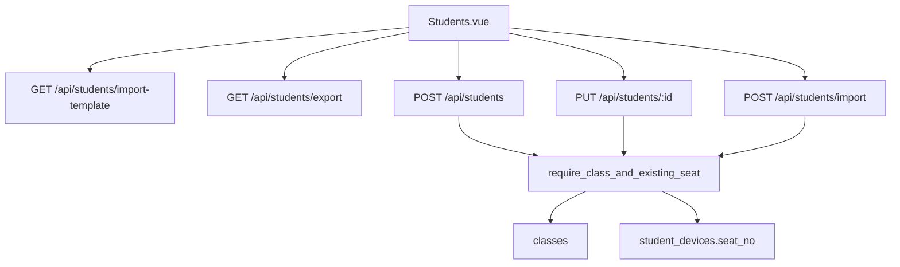

# 学生导入模板、导出登录态与班级座位必填

Feature Name: student-import-class-seat
Updated: 2026-09-18

## Description

学生管理页提供带 JWT 的模板下载与名单导出。创建、更新、导入均要求班级与座位号，且座位号必须已出现在该班设备座位中。导入任一行失败则整文件回滚。

## Architecture

前端导出/模板改为 axios `responseType: blob` 并附带 Bearer token，替换 `window.open`。

## Components and Interfaces

- `teacher-web/src/views/Students.vue`：下载模板、blob 导出、班级/座位必填，座位下拉来自班级设备
- `teacher-web/src/api/students.ts`：`exportStudents`、`downloadStudentTemplate`
- `teacher-server/src/api/student_handlers.rs`：模板、导入列（学号/姓名/班级/座位号/密码）、导出含班级
- `teacher-server/src/domain/student.rs`：`require_class_and_existing_seat`、`find_class_id_by_name`

## Data Models

导入列顺序：学号、姓名、班级（名称）、座位号、密码。班级按 `classes.name` 解析为 `class_id`。

## Correctness Properties

1. 创建/更新成功的学生同时具有非空 `class_id` 与非空 `seat_no`
2. 该 `seat_no` 等于同班某设备的 `seat_no`（trim 后）
3. 导入失败时不新增、不更新任何学生行

## Error Handling

校验失败返回 `code=400` 与中文 `message`（含导入行号）。导出未登录由现有 JWT 中间件返回 401，前端拦截跳转登录。

## Test Strategy

domain 单测：缺班级/缺座位/座位未分配给设备时创建失败；设备已分配座位后创建成功。

## References

- `CampusLink-NCMS/teacher-web/src/views/Students.vue`
- `CampusLink-NCMS/teacher-server/src/api/student_handlers.rs`
- `CampusLink-NCMS/teacher-server/src/domain/student.rs`
